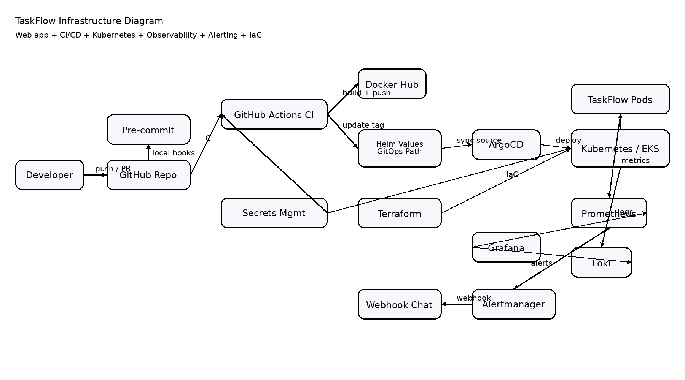

# TaskFlow

TaskFlow е примерен web-базиран проект за управление на задачи, създаден така, че да демонстрира **пълен DevOps lifecycle**: защитени commit-и, CI/CD, контейнеризация, Kubernetes deployment, observability, alerting, GitOps и Infrastructure as Code.

## Какъв проблем решава

Приложението решава прост бизнес проблем: централизирано показване на списък със задачи през web интерфейс и API. Истинската цел на проекта е да покаже как едно приложение се разработва, тества, пакетира, публикува, деплойва и наблюдава по автоматизиран и възпроизводим начин.

## Основни изисквания, които проектът покрива

- Web приложение с UI + API
- Инфраструктурна диаграма
- Pre-commit hooks за качество на кода и защита от качване на тайни
- Пълен CI/CD цикъл
- CI pipeline с lint, security checks, tests, Docker build + push и webhook notifications
- CD с **ArgoCD** и GitOps подход
- Observability: метрики + логове + alerting с webhook notifications
- Оркестратор: **Kubernetes**
- IaC: **Terraform**
- Configuration & Secrets Management чрез **GitHub Secrets**, **Kubernetes Secrets** и възможност за **AWS Secrets Manager**
- Пълна документация

## Използвани технологии и версии

| Технология | Версия / Подход |
|---|---|
| Python | 3.12 |
| FastAPI | 0.115.0 |
| Uvicorn | 0.30.6 |
| Pytest | 8.3.3 |
| Ruff | 0.6.9 |
| Black | 24.8.0 |
| Bandit | 1.7.10 |
| pre-commit | latest compatible |
| Docker | latest |
| GitHub Actions | managed runners |
| Docker Hub | image registry |
| Kubernetes | 1.30 target |
| Helm | v3 |
| ArgoCD | GitOps CD |
| Prometheus | metrics |
| Loki + Promtail | logs |
| Grafana | visualization |
| Alertmanager | alerts + webhooks |
| Terraform | >= 1.7 |
| AWS EKS | примерна cloud платформа |

## Архитектурна диаграма

### Изображение



### Mermaid източник

Файл: `docs/infrastructure-diagram.mmd`

## Архитектура

1. Разработчикът работи локално и при commit минават `pre-commit` проверки.
2. Кодът се качва в GitHub.
3. GitHub Actions изпълнява CI pipeline:
   - lint
   - security checks
   - tests
   - Docker build
   - Docker push в Docker Hub
   - webhook notification
4. След успешен CI, втори workflow актуализира Helm image tag.
5. ArgoCD следи Git репото и синхронизира новата версия към Kubernetes.
6. Приложението експонира `/metrics` за Prometheus.
7. Логовете се събират от Promtail и се изпращат към Loki.
8. Grafana визуализира метрики и логове.
9. Alertmanager изпраща webhook notifications при проблем.
10. Terraform създава и управлява Kubernetes инфраструктурата и namespace-ите.

## Структура на проекта

```text
.
├── app/                         # FastAPI приложение
├── tests/                       # Unit/API тестове
├── .github/workflows/           # CI и CD automation
├── charts/taskflow/             # Helm chart за приложението
├── argocd/                      # ArgoCD Application manifest
├── terraform/aws-eks/           # IaC за Kubernetes средата (EKS пример)
├── monitoring/                  # Alerting и observability манифести
├── docs/                        # Диаграми и документация
├── Dockerfile                   # Контейнеризация на приложението
├── .pre-commit-config.yaml      # Локални проверки преди commit
├── requirements.txt             # Runtime зависимости
├── requirements-dev.txt         # Dev и CI зависимости
└── README.md                    # Основна документация
```

## Локално стартиране стъпка по стъпка

### 1) Клониране

```bash
git clone <your-repository-url>
cd taskflow
```

### 2) Създаване на виртуална среда и инсталация

```bash
python -m venv .venv
source .venv/bin/activate
pip install -r requirements-dev.txt
pre-commit install
```

### 3) Стартиране на тестове

```bash
pytest -q
```

### 4) Стартиране локално

```bash
uvicorn app.main:app --reload --host 0.0.0.0 --port 8000
```

Приложението ще е налично на:

- `http://localhost:8000`
- Health check: `http://localhost:8000/health`
- Metrics: `http://localhost:8000/metrics`

## Стартиране с Docker

### Build

```bash
docker build -t taskflow:local .
```

### Run

```bash
docker run -p 8000:8000 taskflow:local
```

## Pre-commit hooks

Файл: `.pre-commit-config.yaml`

Конфигурираните hooks проверяват:

- YAML синтаксис
- trailing whitespace
- merge conflicts
- private keys
- Python linting с Ruff
- форматиране с Black
- security scan с Bandit
- secret detection с detect-secrets

Така се намалява рискът в Git да попаднат:

- пароли
- private keys
- токени
- небезопасен или лошо форматиран код

Ръчно изпълнение:

```bash
pre-commit run --all-files
```

## CI Pipeline

Файл: `.github/workflows/ci.yml`

CI изпълнява автоматично:

1. Checkout на кода
2. Инсталация на Python зависимости
3. Lint проверки
4. Security scan
5. Тестове
6. Генериране на Docker metadata
7. Login към Docker Hub
8. Build + push на Docker image
9. Webhook notification при success/failure

### Необходими GitHub Secrets

- `DOCKERHUB_USERNAME`
- `DOCKERHUB_TOKEN`
- `CI_WEBHOOK_URL`
- `CD_WEBHOOK_URL`

## CD Pipeline

Файл: `.github/workflows/cd-values-update.yml`

Избраната технология за CD е:

- **ArgoCD** за deployment
- **Helm** за packaging на Kubernetes manifests
- **GitHub Actions** само актуализира image tag в Helm values

Това е GitOps модел:

- CI публикува image
- manifest-ите се обновяват в Git
- ArgoCD автоматично синхронизира кластера

### Защо ArgoCD

- ясен audit trail през Git
- self-heal и drift correction
- лесна визуализация на desired vs actual state
- подходящо за Kubernetes-native deployment

## Kubernetes оркестрация

Използваният оркестратор е **Kubernetes**.

Приложението се deploy-ва чрез Helm chart, който включва:

- Deployment
- Service
- Secret
- readinessProbe
- livenessProbe
- Prometheus annotations за scraping

Основни файлове:

- `charts/taskflow/templates/deployment.yaml`
- `charts/taskflow/templates/service.yaml`
- `charts/taskflow/templates/secret.yaml`

## Observability

### Метрики

Приложението експонира Prometheus-совместими метрики на:

```text
/metrics
```

Примерни метрики:

- `http_requests_total`
- `http_request_duration_seconds`

### Логове

Подходът е:

- приложението пише в stdout/stderr
- Promtail събира контейнерните логове
- Loki ги индексира
- Grafana ги визуализира

Документация: `monitoring/loki-promtail-notes.md`

## Alerting

Файлове:

- `monitoring/prometheus-rule.yaml`
- `monitoring/alertmanager-config.yaml`

Примерни alert-и:

- наличие на HTTP 500 грешки
- липса на налични replicas

Alertmanager може да изпраща webhook notifications към:

- Slack
- Discord
- Microsoft Teams
- custom webhook endpoint

## Infrastructure as Code (IaC)

Папка: `terraform/aws-eks/`

Terraform управлява:

- EKS cluster
- managed node group
- Kubernetes provider
- namespace-и за `taskflow` и `monitoring`

### Примерен Terraform flow

```bash
cd terraform/aws-eks
terraform init
terraform plan
terraform apply
```

> Забележка: трябва да подадете реални стойности за `vpc_id` и `private_subnet_ids`.

## Configuration & Secrets Management

Използван модел:

### Локално / CI

- GitHub Secrets за Docker Hub credentials и webhook URLs

### Kubernetes runtime

- Kubernetes Secrets за runtime configuration

### Cloud ниво

- може да се надгради с AWS Secrets Manager и External Secrets Operator

### Добри практики

- не се commit-ват тайни в Git
- secrets се подават чрез environment variables / secret stores
- pre-commit и CI валидират риска от изтичане на credentials

## Минимален lead time automation flow

1. Developer пише код
2. Pre-commit блокира проблемни commit-и
3. Push към GitHub
4. CI валидира качество и security
5. Docker image се публикува в Docker Hub
6. Helm values се обновява автоматично
7. ArgoCD засича промяната и прави deployment
8. Prometheus/Loki/Grafana наблюдават състоянието
9. Alertmanager известява при проблем

## Какво може да се доразвие

- PostgreSQL база данни и persistent storage
- ingress + TLS с cert-manager
- External Secrets Operator
- SAST/DAST разширение в CI
- blue/green или canary deployment
- OpenTelemetry tracing
- отделна production/staging среда

## Команди за бърз преглед

```bash
pytest -q
ruff check .
black --check .
bandit -r app
pre-commit run --all-files
docker build -t taskflow:local .
```

## Заключение

Този проект е подходящ за предаване по DevOps/Cloud Automation дисциплина, защото покрива пълната верига от разработка до production deployment и наблюдение, като всички ключови компоненти са описани, автоматизирани и версионирани.
